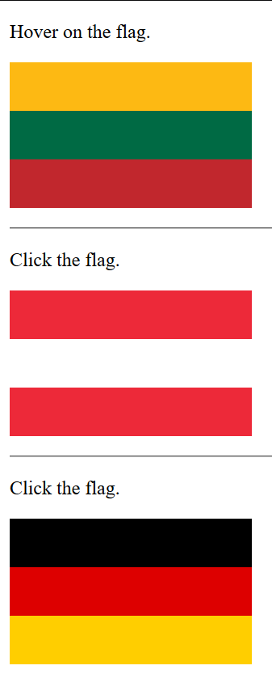

# JavaScript-manipulation - Flags

On hover - the colors of the flag changes to grey.

On the click of Austria's flag - starts changing the flags from array in random order.

On the click of Germany's flag - starts changing flag colors.

